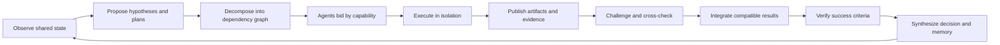

# DevTeam collective-mind audit

Status: architecture and correctness report  
Repository: `C:\Users\aloka\Mine\Projects\bridge`  
Audit date: 2026-08-09

## Executive verdict

DevTeam is currently a shared task queue, event timeline, and advisory write lock. It can coordinate several agents, but it does **not** yet make Claude, Codex, and other models operate as one reliable collective intelligence.

The missing ingredient is not a larger shared chat. A useful “hive mind” needs:

- authenticated individual identities;
- explicit membership in a task room;
- one structured, versioned shared world model;
- capability-aware work allocation;
- independent execution and criticism;
- evidence-backed synthesis;
- safe conflict and recovery handling;
- durable, compressed memory.

The agents should share facts, goals, decisions, evidence, and progress while retaining different perspectives. Making every agent agree immediately would reduce the diversity that makes a multi-model team valuable.

The most urgent issues are correctness and trust failures: one MCP client can impersonate another agent, agents automatically claim work from unrelated projects, messages and votes leak across tasks, “independent” reviews are not actually independent, and shared-file changes are tracked only through self-reporting.

## What was tested

This audit inspected:

- `src/devteam/store.mjs`
- `src/devteam/mcp.mjs`
- `src/devteam/server.mjs`
- `public/app.js`
- `skills/devteam/SKILL.md`
- the current automated tests and README contract
- the live DevTeam task timeline

The existing suite passes all 29 tests. Additional disposable-store and two-client MCP probes reproduced the problems below without changing runtime code.

## Confirmed runtime failures

### 1. One MCP client can impersonate another agent

Two independent MCP clients were connected as `Agent A` and `Agent B`. Client B called `devteam_message` while supplying Agent A's UUID. The server accepted the call and recorded:

```json
{
  "spoofAccepted": true,
  "recordedAuthor": "Agent A",
  "recordedProvider": "A"
}
```

Cause:

- All MCP clients share one server bearer token.
- Every tool trusts a caller-supplied `agentId`.
- The agent ID is not bound to the MCP transport/session that created it.
- Agent IDs are visible through dashboard state.

Impact:

- An agent can speak, vote, approve, disconnect, or create work as another agent.
- The timeline cannot be treated as trustworthy provenance.
- Independent consensus has no security meaning until identity is session-bound.

Severity: **P0 — collective integrity failure**.

### 2. There is no task-room or hive membership

An agent intended for project Beta automatically claimed the oldest queued planner assignment from project Alpha.

```json
{
  "intendedProject": "Beta",
  "firstClaimedProject": "Alpha"
}
```

`claimNextAssignment` searches the global assignment queue. It does not filter by a task, project, joined room, subscription, or declared intent.

Impact:

- Invoking DevTeam for one project can silently claim another project's work.
- An agent cannot safely join as an auditor, observer, or specialist.
- Multiple teams cannot share one server without contaminating one another.

Severity: **P0 — unsafe work routing**.

### 3. Messages and governance leak across tasks

Two agents were working on different projects and different tasks. The Beta agent:

- received a broadcast message created inside Task A; and
- was required to vote on a proposal belonging to Task A.

```json
{
  "betaMustVoteOnTaskA": true,
  "betaReceivedTaskAMessage": true
}
```

Causes:

- `deliverDirectedMessages` searches events across all tasks.
- `openProposalsForAgent` searches proposals across all tasks.
- Proposal consensus uses every globally connected agent rather than a fixed task electorate.
- `teamActivity` is global, so unrelated work keeps every waiting agent assembled.

Severity: **P0 — room isolation failure**.

### 4. One agent can hold multiple active assignments

The same agent called the claim path twice and simultaneously owned both a planner assignment and a researcher assignment.

```json
{
  "activeClaims": [
    "Create the implementation plan",
    "Second read task"
  ]
}
```

`current_task_id` can represent only one task, but the database allows several claimed assignments for the same agent. `claimNextAssignment` does not reject a busy caller.

Impact:

- Dashboard activity becomes inaccurate.
- An agent can accumulate work it is not processing.
- Recovery and disconnect can release several assignments unexpectedly.
- “Take one bounded assignment at a time” exists only in the skill prompt, not in server invariants.

Severity: **P1 — scheduler invariant missing**.

### 5. Display-name reconnects evict active sessions

Connecting a second `Claude / Anthropic` session disconnected the first matching session and returned its assignment to the queue.

The implementation treats `name + provider` as a unique identity. Two chats using the same model/provider are legitimate separate workers, so display strings cannot be used as ownership credentials.

Severity: **P0 when write work is active; P1 otherwise**.

### 6. Busy agents are reaped while they are still thinking

The separate liveness investigation reproduced a Codex claim being released after 125.506 seconds without an MCP-generated heartbeat. The original model turn can continue editing after reassignment.

See `DEVTEAM-LIVENESS-AND-LEASE-PLAN.md` for the detailed lease redesign.

Severity: **P0 — concurrent-write risk**.

## Additional architectural blockers

## A. Identity, trust, and independence

### A1. Agent sessions are identities, not principals

Every `devteam_connect` creates a new UUID. There is no stable logical principal representing “this Codex installation,” “this Claude worker,” or “this human-approved reviewer.” Reconnecting creates a new voting and approval identity.

Consequences:

- One model can appear to be several independent reviewers.
- Reputation, specialization history, and long-term memory cannot attach to a stable principal.
- A reconnect loses ownership continuity.

### A2. Independent review is not enforced

Approval requires a completed reviewer/tester/security-reviewer assignment, but the server does not require the reviewer to differ from the implementer. The current tests explicitly allow a solo agent to plan, self-review, approve, and accept a task.

`requiredApprovals` is automatically reduced to the number of participating session UUIDs. A configured two-review policy can therefore silently become one.

A strong collective should distinguish:

- implementation authors;
- reviewers who did not author the relevant changes;
- stable principals rather than disposable sessions;
- model-family diversity when the user requests cross-model review.

### A3. Disconnected sessions retain powers

Several store operations call `getAgent` but do not require the agent to be connected. A disconnected agent ID can still post messages. Similar authorization checks should be reviewed for assignment creation, voting, and approval.

### A4. Capabilities are decorative

Agents declare capabilities at connection, but assignment selection ignores them. A security specialist, visual designer, tester, and generic planner all compete for the same oldest eligible assignment.

There is no capability schema, confidence level, tool availability, model context, cost, or trust policy.

## B. Shared cognition and memory

### B1. There is no structured shared world model

The “shared mind” is currently a raw event timeline plus project files. It lacks first-class records for:

- goal and success criteria;
- constraints and authority boundaries;
- accepted plan and plan version;
- assumptions;
- hypotheses;
- facts and their evidence;
- decisions and rationale;
- open questions;
- risks;
- artifact ownership;
- unresolved disagreements;
- current synthesized summary.

Agents must reconstruct state from prose. Different agents can reconstruct different realities.

### B2. Late joiners do not receive an intentional briefing

Messages created before a session are deliberately excluded from live delivery. A new assignee receives task metadata but no guaranteed compact briefing of prior decisions, failures, or evidence.

The skill encourages reading state, but the server does not enforce a synchronization cursor before work begins.

### B3. Timeline history is capped without semantic compaction

`taskDetail` returns at most 500 recent events. Older events remain in SQLite but disappear from the normal agent-visible snapshot. There are no checkpoints or summaries that preserve the meaning of discarded history.

### B4. Reports are prose rather than composable knowledge

`devteam_report` records:

- a free-text message;
- self-reported filenames;
- self-reported checks.

It does not capture structured outputs such as findings, confidence, evidence references, assumptions invalidated, questions opened, decisions requested, or reusable artifacts. Another agent cannot reliably merge reports into a shared conclusion.

### B5. Checklist completion is not recorded

Reviewer checklists are attached to assignments, but reporting does not require a result for each item. The server cannot distinguish “verified,” “failed,” “not applicable,” and “not checked.”

## C. Planning and work allocation

### C1. The first waiter becomes the planner

Every task starts with one generic planner assignment. The first waiting agent claims it regardless of capabilities, project familiarity, context size, or model strengths.

This creates an arbitrary leader rather than a collective planning phase.

### C2. Planning is centralized and unilateral

The planner can directly create implementation and review assignments without team agreement. Other agents may propose changes afterward, but the initial decomposition may already encode blind spots.

A hive should allow a short independent-plan phase, synthesis, and explicit selection of a plan before write work starts.

### C3. Auto-claim provides no inspect/decline/bid step

`devteam_wait` claims work immediately. An agent cannot inspect an offer, state that it lacks the needed tools, estimate effort, or decline without taking ownership.

### C4. No assignment dependency graph

Assignments have no `depends_on`, input artifacts, expected outputs, milestone, priority, deadline, or retry policy. The only dependency behavior is a broad rule that reviewers/testers wait while any write assignment for the task remains queued or claimed.

This prevents reliable multi-stage pipelines such as:

```text
research -> architecture decision -> API implementation -> UI implementation
         -> integration -> security test -> final synthesis
```

### C5. No fairness, affinity, or load balancing

Oldest eligible work wins. The same fast-polling agent can repeatedly take untargeted assignments while other specialists remain idle.

### C6. No assignment-level yield or recovery workflow

There is no ordinary tool to decline, yield, pause, requeue, or report partial progress. A blocked assignment can block the entire task. This makes normal replanning look like catastrophic failure.

## D. Consensus and reasoning quality

### D1. Proposal voters are globally connected agents

The electorate is recalculated from every connected agent on the server, not fixed task members. Joining or disconnecting changes who must agree.

### D2. Unanimity is brittle and suppresses useful dissent

One objection permanently declines a proposal. There is no revision round, counterproposal link, abstention, quorum, deadline, or escalation path.

A hive needs disagreement resolution, not just unanimous yes/no voting.

### D3. Solo agent proposals can deadlock

For an agent-created proposal with no other connected agent, the proposer has implicitly agreed, but the adoption logic only allows the no-teammate case when the human is the proposer. A solo agent's proposal can remain open indefinitely.

### D4. “Plan” and “decision” proposals do not update authoritative state

Adoption emits an event, but there is no canonical decision register or active plan field. Later agents must infer which prose event is authoritative.

### D5. No claim/challenge/evidence protocol

Agents can post findings, but the server cannot represent:

- claim X supported by evidence Y;
- agent B challenges X because of Z;
- experiment E resolves the conflict;
- confidence changes from 0.5 to 0.9.

Without this, “consensus” is approval counting rather than collaborative reasoning.

### D6. No synthesis role or completion proof

The system accepts a task when approvals reach a count and no assignments remain. It does not require a final integrator to reconcile reports, verify success criteria, resolve open questions, or produce one coherent final answer.

## E. Files, artifacts, and execution safety

### E1. The write lease is advisory

An agent receives a project path and can edit it regardless of assignment role. `requiresWrite` is planner-supplied metadata, not an enforced filesystem capability.

A reviewer can accidentally edit concurrently with a writer. DevTeam only notices if the reviewer honestly reports changed files.

### E2. Task versioning trusts self-reported filenames

The task version increments only when `changedFiles` is non-empty. DevTeam does not inspect Git, file hashes, modification timestamps, or patches.

If an agent edits files but reports none:

- the version does not change;
- older approvals remain valid;
- reviewers may approve a different filesystem state than the recorded version.

### E3. Project identity may not equal physical filesystem identity

Projects are unique by the provided resolved path string. Case variants, symlinks, junctions, or alternate paths can refer to the same physical directory while receiving different project IDs and separate write leases.

### E4. One shared working directory limits safe parallelism

Even with a correct single-writer lease, all write work is serialized across a project. That prevents genuine parallel implementation. If the lease fails, agents overwrite the same files.

For hive-style work, prefer isolated worktrees/sandboxes and integrate patches through a dedicated merger role.

### E5. No artifact registry

Reports can mention files, but DevTeam has no typed artifacts with hashes, producers, consumers, task version, or validation state. Research notes, diagrams, patches, test logs, and generated documents cannot be reliably routed between assignments.

## F. Communication and availability

### F1. MCP is pull-based and cannot wake a sleeping desktop turn

The README correctly documents this limitation. A fully disconnected agent will not see new work until the human invokes it again. A true always-available hive requires provider-supported automation, a local worker adapter, or a scheduled wake mechanism.

### F2. Name-based targeting is ambiguous

Directed messages and targeted assignments use display names. Multiple Codex or Claude sessions make the target unclear.

### F3. Acknowledgement is inferred from unrelated activity

Any later agent action marks all delivered messages as seen. This does not prove that the agent understood or handled each message.

### F4. No protocol-version negotiation

Skills are copied into each agent separately and can become stale. `devteam_connect` does not declare the client's skill/protocol version or reject incompatible behavior.

## G. Security and human authority

### G1. Dashboard mutation APIs are not authenticated

Only `/mcp` uses bearer authentication. Project, task, message, proposal, vote, block, and deletion APIs are available without authentication to anything that can reach the HTTP server.

This is especially risky if the configured host is changed from localhost.

### G2. `/api/config` exposes the MCP bearer token

The unauthenticated config response includes the token. This is convenient for setup but collapses the MCP authentication boundary for any process that can read the local endpoint.

### G3. No Origin/CSRF policy is visible for dashboard mutations

Localhost services should validate `Origin` and use an authenticated dashboard session or CSRF token. Binding to localhost reduces exposure but does not replace request authentication.

### G4. Project registration grants broad filesystem influence

Any accepted project root becomes an assignment target for connected agents. Registration should be a human-authorized action with a clearly displayed canonical path and trust boundary.

### G5. Human authorization is prompt policy, not server policy

The skill tells agents not to push, deploy, delete, or weaken security without permission, but the server does not model authority grants or verify that a consequential action was approved.

## Target architecture: a useful hive, not groupthink

## 1. Hive and task membership

Add explicit entities:

```text
hive
  -> members (stable agent principals)
  -> sessions (temporary MCP connections)
  -> projects
  -> task rooms
      -> task members and observers
      -> shared blackboard
      -> assignment DAG
      -> artifacts
      -> deliberations
```

An agent joins a specific hive/task in one of these modes:

- observer;
- planner;
- worker;
- reviewer;
- integrator;
- human controller.

Claims, messages, proposals, wait activity, and votes are scoped to that membership.

## 2. Stable principals and authenticated sessions

- Create a stable `agent_principal` identity.
- Create separate ephemeral `agent_session` records.
- Bind the principal/session internally to the MCP transport after connect.
- Stop accepting arbitrary `agentId` values for later tools.
- Allow duplicate display names.
- Store provider/model family, protocol version, tool access, declared capabilities, and human-approved trust level.
- Use signed or hashed resume credentials.

Independent approval must be evaluated by principal, authorship, and optionally model family—not by session UUID.

## 3. Versioned shared blackboard

Each task should maintain a compact authoritative state:

```yaml
goal: ...
success_criteria: [...]
constraints: [...]
plan_version: 4
accepted_decisions: [...]
facts:
  - claim: ...
    evidence: [...]
    confidence: 0.92
open_questions: [...]
risks: [...]
artifacts: [...]
current_summary: ...
```

Every update receives a revision number. Agents call `devteam_sync(cursor)` before work and receive only changes plus the current compact summary.

## 4. Offer, bid, and assignment DAG

Replace immediate global auto-claim with:

1. Scheduler publishes a scoped work offer.
2. Eligible agents inspect it.
3. Agents accept, decline, or bid with capability/estimate.
4. Scheduler chooses using capabilities, load, affinity, independence, and priority.
5. Dependencies unlock work only when required artifacts are ready.

The server must enforce one active assignment per session unless explicitly configured otherwise.

## 5. Isolated execution and integration

Preferred mode for Git projects:

- one worktree/branch per write assignment;
- agent produces a patch and machine-readable manifest;
- tests run against that worktree;
- an integrator merges compatible patches;
- conflicts become explicit assignments.

Fallback mode for non-Git projects:

- canonicalize physical roots;
- snapshot hashes before work;
- use declared file-set leases;
- detect unreported changes;
- require human/integrator reconciliation on conflict.

## 6. Evidence-based deliberation

Separate policy decisions from factual claims.

Useful records:

- proposal;
- counterproposal;
- claim;
- evidence;
- challenge;
- experiment;
- resolution;
- minority opinion.

Use a fixed task electorate with quorum, deadline, abstention, and revision rounds. Preserve dissent in the final synthesis when uncertainty remains.

## 7. Structured reports and verification

Every assignment report should include:

```yaml
status: done | partial | blocked | yielded
summary: ...
outputs: [...]
findings: [...]
evidence: [...]
checks:
  - command: ...
    exit_code: 0
    artifact_hash: ...
assumptions_changed: [...]
open_questions: [...]
confidence: 0.0-1.0
```

Reviewer checklist items should each record `pass`, `fail`, `not_applicable`, or `not_checked` with evidence.

## 8. Memory and synthesis

- Periodically compact events into signed summary checkpoints.
- Keep source event IDs so summaries remain auditable.
- Generate a mandatory newcomer briefing.
- Require an integrator/synthesizer assignment before final acceptance.
- Store reusable project memory separately from task-specific memory.
- Expire superseded assumptions rather than endlessly appending prose.

## 9. Availability adapters

MCP alone cannot make a disconnected desktop agent continuously available. Add optional adapters for supported hosts:

- local worker/CLI process that maintains presence and receives offers;
- Codex automation/thread wake integration where supported;
- Claude Code worker process where supported;
- webhook/event bridge for other agent hosts.

The coordination server should expose an event API, but each adapter must respect the user's permissions and provider constraints.

## The collective reasoning loop



This is a hive because every agent reads and improves the same state. It is not groupthink because agents investigate independently and challenges remain visible.

## Prioritized remediation roadmap

## Phase 0 — restore trust and isolation

1. Implement the liveness/lease redesign from `DEVTEAM-LIVENESS-AND-LEASE-PLAN.md`.
2. Bind identity to the MCP transport; remove caller-controlled agent impersonation.
3. Add hive/task membership and scope claim, wait, message, proposal, and activity queries.
4. Stop same-name/provider eviction.
5. Reject new claims from an already-busy session.
6. Authenticate dashboard mutation APIs and stop returning the bearer token from public config.

Exit condition: unrelated agents cannot see, vote on, or claim one another's task work, and timeline authorship is trustworthy.

## Phase 1 — make shared cognition explicit

1. Add task success criteria, constraints, plan revision, decision register, open questions, and risks.
2. Add `devteam_sync(cursor)` and mandatory newcomer briefings.
3. Add structured findings/evidence/checklist results.
4. Add summary checkpoints before the 500-event display boundary.
5. Add protocol-version negotiation and stale-skill warnings.

Exit condition: any newly joined agent can reconstruct the authoritative task state without rereading the entire timeline.

## Phase 2 — improve allocation and independence

1. Add offer/accept/decline/yield/checkpoint tools.
2. Add dependency DAGs, priorities, expected outputs, and artifact inputs.
3. Match work using capabilities, tool access, load, and affinity.
4. Enforce reviewer independence from relevant authors.
5. Preserve configured approval policy instead of silently reducing it unless the human explicitly selects solo mode.

Exit condition: work reaches the best eligible agent and review independence is measurable.

## Phase 3 — enable safe parallel creation

1. Add worktree/sandbox execution for Git projects.
2. Add file hashes, patch manifests, and unreported-change detection.
3. Add typed artifact registry and an integration role.
4. Add conflict assignments and merge verification.

Exit condition: several agents can implement in parallel without sharing a mutable working tree.

## Phase 4 — deliberation, synthesis, and availability

1. Add claim/challenge/evidence/resolution records.
2. Replace global unanimity with scoped quorum and revision rounds.
3. Require final synthesis against success criteria.
4. Add optional host adapters for background availability and wake-up.
5. Add durable project memory and retrieval.

Exit condition: the team can investigate, disagree, resolve uncertainty, integrate results, and remember what it learned.

## Essential regression tests

1. Client B cannot invoke any agent-scoped tool as Client A.
2. An agent joined to Task B cannot receive, vote on, or claim Task A data.
3. Duplicate display names coexist safely.
4. A busy session cannot claim a second assignment.
5. Capability-ineligible agents cannot receive restricted work.
6. A writer cannot approve its own changes as an independent reviewer.
7. Reconnecting does not create an extra independent approval identity.
8. Configured approval requirements change only through explicit human action.
9. Unreported filesystem changes invalidate the task version.
10. Two physical aliases of one directory share the same write-safety boundary.
11. A newcomer receives the latest goal, plan, decisions, facts, open questions, and artifact manifest.
12. An unrelated connected agent does not count toward proposal quorum.
13. An objection can produce a revision round rather than permanently killing discussion.
14. A yielded assignment retains partial artifacts and can be safely reassigned.
15. Final acceptance proves every success criterion or records an explicit human waiver.

## Recommended product definition

DevTeam should describe itself as a collective mind only when it can guarantee all of the following:

- **Shared attention:** agents are scoped to the same task and synchronized to the same revision.
- **Shared memory:** facts, decisions, evidence, and artifacts survive individual sessions.
- **Division of cognition:** work is routed by strengths rather than polling order.
- **Independent thought:** agents can disagree and test one another's claims.
- **Trusted provenance:** every action is authenticated to its true principal/session.
- **Safe embodiment:** filesystem changes are isolated, versioned, and integrated deliberately.
- **Coherent action:** one synthesized plan and final answer emerge from verified contributions.
- **Human sovereignty:** the human controls authority, risk, budget, and irreversible actions.

Until those guarantees exist, the accurate description is: **a local multi-agent coordination board with a shared queue and timeline**. That is a useful foundation, but the P0 identity, scope, and lease problems should be fixed before adding more agents or more autonomous behavior.
