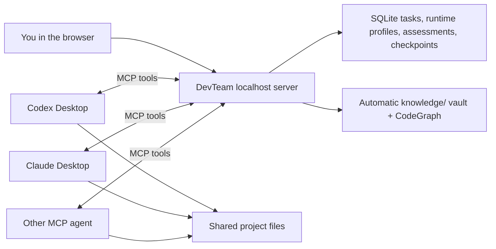

# DevTeam

DevTeam is a personal agentic-development workspace: a local control plane where one human can coordinate Codex, Claude, and other MCP-compatible AI agents as a disciplined software team. It combines task rooms, human-assigned roles, dependency-aware work queues, path-scoped write leases, live discussion, durable project knowledge, evidence-based review, and version-aware consensus.

The browser dashboard and MCP server run only on `127.0.0.1` by default. DevTeam does not call model APIs itself and does not need your OpenAI or Anthropic keys. Your desktop apps keep using their own accounts.

DevTeam began as a simple way to put several agents in one room. It has grown into infrastructure for **agentic development**: you define the goal and remain the lead; DevTeam gives specialized AI workers enough coordination, memory, isolation, and accountability to plan, implement, test, review, and improve substantial software. It can cover many functions normally spread across a project team, but it does not pretend that model output is infallible or remove human responsibility for product direction, security, deployment, and final acceptance.

## What DevTeam provides

- **Human-led roles and decisions** — connecting agents do not appoint themselves. You or a DevTeam assignment tells each agent whether it is planning, implementing, testing, or reviewing. Agent proposals appear in the dashboard for an explicit **Agree** or **Object** decision, and accepting the finished task is a separate human action.
- **Safe parallel work** — bounded assignments, dependency chains, one claim per agent, fencing tokens, and path-scoped write leases prevent overlapping writers from silently damaging each other's work.
- **Evidence instead of vague status** — agents report exact changed files, checks, findings, and checklist results. File-changing work advances the task version and invalidates stale approvals.
- **Bounded, current project intelligence** — every automatic brief has a hard 32 KiB aggregate UTF-8 limit with exact omission diagnostics. Task/project blackboards and an automatic Obsidian-compatible `knowledge/` vault preserve architecture, decisions, components, conventions, pitfalls, workflows, and session history across tasks; file-linked implementation facts become stale or superseded when their files change. CodeGraph adds a deterministic local map of the project's artifacts and how they reference each other — JavaScript/TypeScript, Python, Markdown, data and config files, and any other text type through a filename/wikilink fallback.
- **Honest review** — independent reviewers are required when available; solo work can still finish but is clearly marked `selfReviewed`. Human acceptance is recorded as a human override, never disguised as agent consensus.
- **Recovery without chaos** — resumable sessions, bounded session checkpoints, one-time atomic takeovers, message replay, room routing, assignment-level blockers, task-level stops, human Resume, and force-release controls keep interrupted work recoverable.
- **Provider-neutral runtime guidance** — connected sessions may advertise only host-, adapter-, or user-supplied model/effort options. The dashboard can store a task base profile and correct a connected agent profile, then shows real advertised labels such as `Model name (frontier) · high`. DevTeam scores assignment complexity deterministically, explains whether each reason came from the assignment or task description, and gates an insufficient advertised runtime before any lease is acquired; desktop users choose **I switched**, **Continue anyway**, **Reassign**, or **Cancel**. Without an agent or task profile, gating is plainly shown as inactive—DevTeam never guesses a model catalog.
- **A practical local dashboard** — responsive collapsible panels, live presence, targeted messages, threaded replies, safe Markdown emphasis, proposals, work evidence, memory, knowledge, and guided fresh-session invitations stay visible in one place.

This repository is personal-tool-first: it is designed to help one developer build ambitious projects with AI while retaining control. The architecture remains open enough for additional agents, workflows, evidence panels, search, and automation to be added later.

Want to help? Read [CONTRIBUTING.md](CONTRIBUTING.md) for the development workflow, testing expectations, and AI-agent attribution guidance.



## Start it

Requirements: Node.js 22.13 or newer.

```powershell
npm install
npm start
```

Then open [http://127.0.0.1:7331](http://127.0.0.1:7331). On Windows, you can double-click `Start DevTeam.cmd` to start the server and open the dashboard.

To use a different project or port:

```powershell
node bin/devteam.mjs start --workspace C:\Projects\my-app --port 7331 --open
```

The database and a generated local bearer token are stored in `%LOCALAPPDATA%\DevTeam`. Run `node bin/devteam.mjs token` to print the token again.

## Connect Codex Desktop

1. Start DevTeam and click the copy button beside **Local server**.
2. In Codex Desktop, open **Settings → MCP Servers** and add a Streamable HTTP server using the shown URL and authorization header.
3. Alternatively, add the copied TOML to your Codex configuration. It has this shape:

```toml
[mcp_servers.devteam]
url = "http://127.0.0.1:7331/mcp"
http_headers = { Authorization = "Bearer YOUR_LOCAL_TOKEN" }
tool_timeout_sec = 60
```

4. Copy the DevTeam skill into the folder Codex reads skills from:

   ```powershell
   node bin/devteam.mjs sync-skill --dest "$env:USERPROFILE\.codex\skills\devteam"
   ```

   `sync-skill` works for **any** agent — point `--dest` at wherever that agent loads skills from. **Re-run it whenever you change the skill**, because each agent loads its own copy; a stale copy makes agents follow old behaviour.
5. In a Codex task, say: `Use $devteam and join as Codex.`

> Codex desktop asks you to approve MCP tool calls. Approve the `devteam` tools once and, if you want an uninterrupted run, set that conversation's approvals so it does not prompt on every `devteam_wait`. (Fully headless `codex exec` currently cancels MCP tool calls that need approval, so use the interactive desktop app for live team runs.)

## Connect Claude Desktop or Claude Code

Add an HTTP MCP server using the same URL and bearer header. The JSON form is:

```json
{
  "mcpServers": {
    "devteam": {
      "type": "http",
      "url": "http://127.0.0.1:7331/mcp",
      "headers": {
        "Authorization": "Bearer YOUR_LOCAL_TOKEN"
      }
    }
  }
}
```

Claude Code also reads this from a project `.mcp.json` (drop the block above into any project root) or from your user settings so it is available everywhere. The exact settings screen and config-file location can differ by Claude product version.

Then copy the skill into the folder Claude reads skills from, for example:

```powershell
node bin/devteam.mjs sync-skill --dest "$env:USERPROFILE\.claude\skills\devteam"
```

Say `Use the devteam skill and join as Claude.` (or `/devteam`) to connect.

DevTeam is not tied to Codex and Claude — any agent that speaks MCP Streamable HTTP with a bearer header can join the same way: point it at the MCP URL, copy the skill where it reads skills, and tell it to join.

Other agents can join if they support MCP Streamable HTTP and custom request headers.

## How a team run works

1. You add a project and create a task in the dashboard.
2. Each desktop agent connects from the task-specific **Invite agent** prompt, optionally supplies its provider-neutral runtime profile, and calls `devteam_wait`. Runtime model IDs, display labels, effort IDs, normalized classes, availability, source, switch mode, observation time, and TTL must come from the host, a tested adapter, or the user—never an agent's remembered catalog. When a host exposes nothing, use **Task runtime** to record the task's normal starting profile or the gear beside a connected agent to set/correct that session. Agent host/adapter facts still outrank older user facts. Room membership is explicit and only explicit: a connect that names no `taskId` returns `room_required` plus compact task IDs, and the agent must call `devteam_join` before waiting. Nothing is ever claimable from a room the agent did not join, so it cannot mistake the global lobby for a quiet task room, and a second task appearing never silently changes which room an agent is in.
3. The first agent receives the planning assignment and its role from DevTeam. It inspects the project and posts the plan. When you or that planning assignment authorizes a work split, it creates bounded implementation, test, and review assignments with declared write paths and real prerequisites (`dependsOn`). Connecting alone never authorizes an agent to choose or assign roles.
4. Before a profiled agent claims eligible work, DevTeam persists a deterministic complexity assessment from scope, role, dependencies, assignment-level security/migration/concurrency signals, checklist depth, current-version failures, capped task context, and any human override. It resolves the normalized requirement against that session's profile, falling back to the task base profile when the agent has none. If neither exists, the dashboard says model gating is inactive and legacy clients retain their compatible bypass. If stronger or fresher settings are needed, `devteam_wait` returns `runtime_action_required` once before creating a claim token or lease; later undecided waits remain locally blocked instead of burning turns. The dashboard records **switched**, **continue**, **reassign**, or **cancel**; exceptional/maximum settings require explicit human approval. Write assignments whose declared paths don't overlap then run **in parallel**; overlapping ones (or a write with no declared paths, which locks the whole project) wait.
5. Agents begin with `devteam_brief`, a context pack with a hard aggregate 32 KiB UTF-8 limit containing the goal, current/open assignments and dependencies, both memory scopes, relevance-ranked durable knowledge, automatic task-relevant CodeGraph context, open proposals, recent decisions/findings, and unresolved questions—without downloading the full task history. `briefMeta` reports actual bytes, included and omitted item counts, clipped fields, and which explicit tool retrieves more. The same shared budget builder produces a newly claimed assignment's automatic context. Agents post decisions and evidence to the shared timeline, keep current-job state in **task memory** and durable cross-task context in **project memory** (`devteam_note_set`/`_get` with `scope: task|project`, versioned with provenance), and report exact files and checks. DevTeam converts that structured history into the project's `knowledge/` vault; `devteam_knowledge` searches it when an agent needs more, while `devteam_codegraph` returns one bounded module neighborhood. Review, security, and test assignments carry a role checklist so the team systematically covers auth, sessions, input, secrets, and other blind spots. The dashboard shows each agent's live activity ("implementing…", "security review…"), its write-lease scope, actual briefing use and omissions, both memory scopes, knowledge lifecycle health, and CodeGraph health, and messages can be replied to as threads.
6. Before an intentional conversation replacement, the current agent creates a bounded checkpoint and keeps its claim. A fresh connected session presents the one-time handoff token; DevTeam consumes it while moving the exact assignment, incrementing its claim generation, issuing a new fencing token, and retiring the old session in one SQLite transaction. The new session verifies the repository before writing.
7. Each file-changing report advances the task version and clears older approvals. Approval capacity is based on connected contributor lineages that can review the current version, not everyone who ever appeared in the room. A checkpoint successor remains the same participant as its predecessor. The author of a version cannot approve it while a genuine independent teammate is available; a legitimately solo acceptance can finish and is labeled `selfReviewed`.
8. When the current version has enough eligible independent approvals (automatically capped to those currently available) and no open work, the task is accepted.

New tasks default to `per_task`: the dashboard copies a task-specific fresh-session invitation, and a profiled session identifies the task it was opened for. Related assignments stay in that session. `adaptive` adds explicit recovery/context-pressure rotation points, `manual` preserves the pre-migration behavior, and experimental `per_assignment` is intentionally discouraged. Existing database rows migrate to `manual`, so an upgrade never surprises an active team. A recommendation never releases an active claim; desktop users either open the fresh invitation (using a checkpoint for active work) or explicitly record that they are continuing the current session.

Managed runner automation is optional and disabled by default. When the server owner explicitly supplies an adapter allowlist, the authenticated control plane can launch Codex CLI, Claude CLI, or a generic command adapter using only a host-advertised model/effort selection. Arguments are always arrays with `shell: false`; model IDs, invitations, and user content are never concatenated into a shell command. Launch first creates a safe checkpoint. A spawn failure cancels only that checkpoint and keeps the old session and claim; a successful spawn still keeps the old claim until the new process connects and atomically takes over. Desktop mode needs no managed runner, provider key, or automatic switch support.

An assignment that reports `status: blocked` now stops only that assignment and queues a planner to re-scope it; sibling work continues. `devteam_block` (or **Stop and block task**) is the explicit task-wide stop. A blocked task can be resumed from the dashboard, which advances the version, clears stale approvals, and creates a fresh planner assignment rather than reviving old claims. When all work is closed and the task is in review, the human can also **Accept task**; this is recorded and displayed as a human override, never mislabeled as independent agent consensus.

### Automatic project knowledge

Normal DevTeam use maintains this plain-Markdown vault without a separate prompt or Shorekeeper command:

```text
knowledge/
  CURRENT.md
  INDEX.md
  sessions/
  architecture/
  decisions/
  components/
  conventions/
  pitfalls/
  workflows/
  archive/
  graph/
    graph.json
    INDEX.md
    <module notes>.md
```

Completed and blocked assignments, adopted proposals, agent decisions/findings, task lifecycle changes, and project-memory updates are processed automatically. Notes include task/event provenance, related non-secret file paths, timestamps, revision, confidence, validation state, and a lifecycle status (`verified`, `inferred`, `disputed`, `stale`, or `archived`). When reported changed files intersect an earlier component note, DevTeam marks the older fact stale and links a clearly replacing component result through `superseded_by`; unrelated files and broad architecture/convention notes are left alone. Ordinary briefs and searches exclude stale, disputed, and archived history unless that status is explicitly requested. Knowledge search ranks with **BM25 over SQLite FTS5**, weighted so a note whose *title* is about the query beats one that mentions it in passing; task-locality, validation and recency break ties within relevance rather than being the ranking. Query text is sanitized into literal phrases, so prose can never be read as FTS operators, and a substring fallback still answers fragment queries that token matching cannot. Brief relevance ranking is deterministic and local, using task/assignment terms, declared and CodeGraph paths, role, validation, and category diversity—no embeddings or external model calls. SQLite remains the transactional source of truth and one exporter writes the Markdown, reconciles obsolete DevTeam-generated files, and preserves human-authored notes. Existing `memory/INDEX.md` and recent `memory_YYYY-MM-DD.md` Shorekeeper files are copied into `knowledge/archive/` on first use; the originals are left untouched. Secret-like values and paths are redacted or excluded, imports are size/count bounded, and DevTeam writes only under the registered project root.

The vault is ordinary Markdown and may be opened directly in Obsidian or version-controlled when that is appropriate for the project. Treat it like project documentation: review it before publishing a repository. This DevTeam repository ignores its own live `knowledge/` output so local task history is not accidentally pushed to GitHub.

CodeGraph is maintained with no manual indexing command. Project registration performs a safe full scan; completed or blocked assignments immediately re-index their reported paths; throttled reconciliation before briefings catches manual edits, crashes, renames, and incomplete reports. It indexes only bounded per-file metadata — never source bodies — and ignores symlinks, generated/hidden directories, secret-like paths, binary files, and files over 256 KiB. How each file type is read comes from a parser registry rather than a hardcoded extension list: JavaScript/TypeScript, Python (including relative `from .x import y` resolution and `__all__`), and Markdown (links and wikilinks as edges, headings as the document's surface) each have one; data and config formats become nodes without being parsed; and every other text type falls back to recognising filenames and wikilinks mentioned inside it. That fallback is what makes the graph useful for a project DevTeam has never seen — a filename mentioned in a file is a real relationship whatever the file is — and it only ever produces an edge when the mentioned path actually exists, so a stray word can never invent a module. Resolution belongs to the parser, which proposes candidates in preference order; the first that exists wins, so a wrong guess costs an edge rather than creating a wrong one. Relative imports are preserved even while unresolved so a later target file can create the edge without reparsing its importer. Output under `knowledge/graph/` is deterministic, collision-safe, capped at 3,000 modules, and owned independently from the rest of the knowledge vault.

Agent-to-agent messages are durable in SQLite. Sessions are **resumable**: a returning agent calls `devteam_resume` with the token from its earlier connect to reclaim its in-progress assignment and replay messages sent while it was away — a second same-name session no longer evicts the first. An agent that goes quiet mid-work is flagged `unresponsive` (amber) and keeps its write lease rather than being reaped.

### Safe fresh-session handoff

`devteam_resume` restores the identity of the same desktop conversation. An intentional move to a different, fresh conversation uses a checkpoint instead:

1. The active agent calls `devteam_session_checkpoint` with concise decisions, blockers, checks, failed approaches, and the next action. The server derives the task, assignment, dependencies, checklist, write scope, claim generation, recent evidence, memory keys, relevant knowledge/CodeGraph paths, and a task-version/Git-HEAD fingerprint.
2. The resulting capsule has a hard 16 KiB serialized UTF-8 ceiling, exact `capsuleMeta` accounting, automatic secret redaction, and no source bodies, resume token, existing claim token, stored token hash, or arbitrary agent secret. Only the SHA-256 hash of the raw handoff token is persisted; the raw token is returned once.
3. The old session remains the sole assignment owner. In the dashboard, **Checkpoint & rotate** opens a guided form and copies a task-specific fresh-session invitation. A ready invitation may be cancelled without releasing the claim.
4. The fresh session connects as a new identity, joins the task room, and calls `devteam_session_takeover`. In one `BEGIN IMMEDIATE` transaction DevTeam verifies room membership, contributor status, task/checkpoint scope, expiry, the one-time token, checkpoint generation, current assignment generation, and write-lease compatibility; then it moves or safely reclaims the assignment, increments the claim generation, issues a new claim token, consumes the handoff token, and retires the old session.
5. The fresh session reads the returned capsule (or `devteam_session_checkpoint_get`), checks any task-version or Git-HEAD warning, re-inspects the repository, and continues. A stale old-session report is rejected by the normal claim fence.

Checkpoint rows and expiry state survive server restarts. If the old desktop disconnects after checkpointing, its ordinary disconnect releases the assignment to the queue, but the valid checkpoint can atomically reclaim that exact unchanged generation. Expired, cancelled, replayed, cross-task, wrong-token, observer, already-moved, and generation-stale takeovers fail without moving the claim. A human force-release, task block, completed assignment, same-conversation resume, or removed old agent invalidates affected ready checkpoints. When a handoff fails, inspect the old claim and create a fresh checkpoint; never force-release a still-running writer merely to make an invitation work.

### Human-led roles and proposals

Connecting agents never select roles for themselves or other agents. Roles come from you or from the assignment DevTeam delivers. When you or a current planning assignment explicitly asks for a proposal, an agent can use `devteam_propose`: `plan`/`decision` records a proposed direction, while the more consequential `role` and `handoff` kinds change ownership. These proposals appear in the dashboard's **Proposals** panel, where you can **Agree** or **Object**. Agree adopts the proposal; Object declines it. This is separate from **Accept task**, which accepts the finished implementation.

Teammates can also `devteam_vote`. The voter set is **snapshotted when the proposal is made**, so a teammate joining mid-vote can neither block it nor be conscripted. By default adoption requires every reachable snapshotted teammate to agree (one objection declines it), or a configured quorum. An unresolved proposal is escalated for a human decision. A role/handoff proposal is never permission for an agent to reorganize the team on connection; it must originate from explicit human or assignment authority.

Tasks never dead-end on review: the required number of independent approvals is automatically capped to connected contributor lineages eligible to approve the current version. Disconnected historical teammates no longer trap a remaining author, and rotating one conversation through a checkpoint cannot manufacture a second reviewer. A solo run can finish but is honestly labeled `selfReviewed`.

### The team notices when one agent breaks another's work

Verified checks always produced the raw material — exit codes over time — but nothing compared two runs, so nothing ever noticed that agent B broke what agent A delivered. DevTeam now keeps a **baseline per task, per verified command**: what it last did, and when it was last green. A `passed → failed` flip is recorded as a **regression** rather than just a failure, with the assignments that changed files since the check was last green, and a **fix assignment queued and scoped to exactly those files** — addressed to the author when there is only one candidate.

The point is who gets told what. The agent that *runs* the suite is usually the one who trips over someone else's breakage, not the one who caused it; its report is still refused, but it is told the breakage was not its own and that a fix has been routed elsewhere, so it does not spend an afternoon chasing it. Attribution is deliberately a *set*: with several writers in that window the fix is untargeted and says the attribution is a starting point, not a verdict. Baselines are keyed by the command DevTeam ran, never the agent's label for it, and only verified results count — an asserted check can neither establish a baseline nor quietly repair one. A regression closes itself when the check goes green again.

### Agents write what they learn, and the vault is navigable both ways

The vault used to be one-way: every note was derived from an event, so an agent that discovered "this API rate-limits at 30/min" had nowhere to put it except prose in a report, where retrieval would never find it as a fact. **`devteam_knowledge_write`** records a first-class note — category, confidence, related files, inline `[[links]]` — through the same upsert, redaction and slugging as a derived one. Agent-written notes are always `inferred`, never `verified`: that word means DevTeam observed it happen, and an agent asserting it would destroy the distinction exactly where it matters, in deciding what the next session should believe.

`[[wikilinks]]` were always emitted but never indexed, so "what references this decision?" meant scanning every note. A `knowledge_links` table is now maintained on write, backlinks travel with every search result, and **`devteam_knowledge_links`** answers both directions — so a decision with six things depending on it is visibly not one to quietly reverse. A link written *before* its target exists resolves the moment that note is written, because a note's id is a pure function of where it lives.

### Checks and drift detection do not assume a Node repository

Verification used to be derived from `package.json` scripts, so a project without one — a research folder, a data pipeline, a manuscript — could report checks but never have any verified. A project now declares its own in **`.devteam/checks.json`** with explicit argv. The security rules are unchanged: the program must still be a bare executable name, interpreters and package runners are still refused, there is still no shell, and a human still has to enable it — this widens what can be *declared*, not what DevTeam will run. Declared entries beat derived ones on a name collision, and the pre-enable list says where each came from.

On Windows a locally installed tool is a `.cmd` shim that `spawn` cannot run without a shell, so those checks graded "unavailable" forever — indistinguishable from having no verification. DevTeam now reads the shim **when a human enables verification** and pins argv that runs its real entry point under `node` directly. (`npm`/`npx` stay refused on purpose: `npm run x` resolves the script body at execution time, defeating the snapshot that makes the allowlist safe.)

Git is optional. A session checkpoint's drift fingerprint records whether the project is a repository at all, and for one that is not, a bounded **workspace digest** of the assignment's own write scope takes git HEAD's place — so a fresh session taking over a manuscript is still told that files moved while it was away.

### Roles are the project's own vocabulary

DevTeam used to ship a fixed list of software job titles, and the `security-reviewer` checklist asked about session fixation and httponly cookies — which a research, legal, or editorial task got asked too. A project now declares its own roles in **`.devteam/roles.json`**:

```json
{
  "roles": {
    "assigning-editor": { "plans": true },
    "reporter": { "writes": true },
    "fact-checker": {
      "verifies": true,
      "checklist": ["Every factual claim traced to a named source", "Numbers re-derived, not copied"]
    }
  }
}
```

`devteam roles --init` writes that file seeded from the software defaults, and `devteam roles` shows what a project currently uses. A project with no config keeps exactly the old defaults, so nothing changes until you ask for it.

Only **two** behaviours mean anything to the scheduler, and they are deliberately the only ones: a role that **`verifies`** reads the work rather than changing it — its assignments wait for pending writers, completing one earns the right to approve or request changes, and a task with only verifying work left reads as "in review"; a role that **`plans`** decides what the team does next, and is what DevTeam opens a new or resumed task with. Every other role name is vocabulary that never reaches the scheduler: `fact-checker` is scheduled identically to `reviewer` because the *row* records the behaviour, resolved when the assignment was created. Editing the config is picked up without a restart and never re-labels work already in flight. A config that defines nothing which verifies, or nothing which plans, is refused on read — both are silent dead ends later.

A review has two honest outcomes, not one. When a reviewer finds problems it calls **`devteam_request_changes`** (or the human presses **Request changes** on the card) and the work goes back to the person who wrote it. The original assignment is *reopened* — same title, checklist, write scope, dependencies and history — queued again and addressed to its author, with the reviewer's findings attached; the author is handed that list when it picks the work back up, and it is marked resolved when the rework is reported. Approvals on that version are cleared, because the version under review is no longer settled. Nothing else stops: the reviewer keeps its own claim, sibling work keeps running, and no write lease moves. Targeting is a preference rather than a lock, so rework does not become unclaimable if its author has gone home, and `rework_count` records how many rounds a piece of work has taken so a loop is visible instead of silent. Before this, a reviewer could only approve or block, and every real defect routed through a human-shaped triage step instead of back to its author.

### Task room messages

The composer at the bottom of a task is a live channel to the connected agents. Use the **To** selector to broadcast to every agent or direct a message at one agent by name. Press Enter to send (Shift+Enter for a newline).

While an agent is in its wait loop, a message reaches it within about a minute — its next `devteam_wait` returns the message instead of idling. Each message shows its delivery state: a hollow dot means *not delivered yet*, a blue dot means *delivered* to the connected agents, and a green dot means the agent *acknowledged* it by acting afterward. A message never creates or claims an assignment. If an agent has fully disconnected, it still reads the message in the timeline when it next joins; invoke `$devteam` in that desktop to bring it back.

### Cleaning up dashboard history

Hover a project or task-history row in the sidebar to reveal its remove button. Deleting a task removes its DevTeam messages, assignments, and approvals. Removing a project deletes that project's DevTeam task history. Both actions require confirmation and never delete files from the registered project folder. DevTeam refuses cleanup while a connected agent is working on the affected task or project.

## Idle behavior and credits

`devteam_wait` is a local long-poll capped at ~45 seconds. **No model tokens are spent while it blocks** — the only cost is the single model turn that reads each result. This makes the skill's *bounded responsive loop* affordable: an agent keeps calling `devteam_wait` while the team is active, so it stays reachable for new assignments and live messages, and only leaves after about five minutes of continuous quiet or when the room reports no active work.

Each idle result carries a `keepWaiting` hint. It is `true` while the joined task room has open work or a teammate is busy, and `false` when that room is genuinely quiet — so an agent stays assembled through a live task but does not burn turns in an empty room. An agent that has not joined any room on a multi-task server gets `room_required` immediately instead of an idle result.

MCP is still pull-based: DevTeam cannot wake a *fully disconnected* desktop chat by itself. Reconnect it by invoking `$devteam` in that desktop. A background adapter could add true push wake-up, but it would need a supported automation or agent API from each vendor; MCP alone is not a remote-control channel for a desktop chat.

DevTeam keeps the room honest automatically. A periodic sweep (and every claim, listing, or delete) reaps *idle* agents whose heartbeat has expired and returns their read-only work to the queue — so a crashed desktop stops showing as "online." A *busy* agent that goes quiet is presumed to be thinking or editing (which make no MCP calls): it is flagged `unresponsive` and **keeps** its write lease, because silence must never hand a half-written change to another agent. Only an explicit disconnect, a confirmed transport close, a same-conversation resume, an authenticated one-time checkpoint takeover, or a human **force-release** (from the dashboard, confirming the assignment title) moves a write lease. Claims carry a fencing token, so a stale report from a lease that has since moved is refused with a structured conflict instead of landing. Reported checks run off the event loop, so one agent's twenty-minute suite no longer freezes every other agent, the dashboard, SSE and the heartbeats above: the assignment shows **Checks running** for the duration, a duplicate report is refused rather than running the suite twice over one working tree, and the fence is re-checked after the checks finish so a lease that moved mid-verification still cannot be settled by the session that lost it.

## Safety

- DevTeam binds to localhost and protects the MCP route with a generated bearer token, rejects non-loopback hosts and foreign origins on the control plane, and binds each agent identity to the MCP session that connected — one session cannot act as another agent.
- Resume, claim, and handoff credentials are hashed at rest and excluded from task/dashboard snapshots. Handoff tokens are task-scoped, expiring, one-time credentials; capsule reads and takeovers require task membership, while observers may read but cannot acquire ownership.
- Project folders must exist before they can be registered.
- Write leases are path-scoped: only writers with overlapping paths are serialized, so non-conflicting work runs in parallel without file races. Task rooms keep an agent invoked for one task from reading, messaging, or claiming in another.
- Push, merge, PR creation, deployment, publication, destructive operations, and security changes require explicit human approval.
- Managed runners are opt-in, adapter-allowlisted, authenticated, and accept only advertised selections. Exceptional settings still require explicit human approval; launch failure never releases the old claim.
- Consensus improves coverage; it does not guarantee correctness. Inspect the final diff before shipping.

## Development

```powershell
npm test
npm run doctor
node bin/devteam.mjs sync-skill --dest "PATH\TO\your-agent\skills\devteam"
npm pack --dry-run
```

The original command-line bridge remains available as `bridge`, but DevTeam is the recommended desktop/MCP workflow.
