# DevTeam

DevTeam is a personal agentic-development workspace: a local control plane where one human can coordinate Codex, Claude, and other MCP-compatible AI agents as a disciplined software team. It combines task rooms, human-assigned roles, dependency-aware work queues, path-scoped write leases, live discussion, durable project knowledge, evidence-based review, and version-aware consensus.

The browser dashboard and MCP server run only on `127.0.0.1` by default. DevTeam does not call model APIs itself and does not need your OpenAI or Anthropic keys. Your desktop apps keep using their own accounts.

DevTeam began as a simple way to put several agents in one room. It has grown into infrastructure for **agentic development**: you define the goal and remain the lead; DevTeam gives specialized AI workers enough coordination, memory, isolation, and accountability to plan, implement, test, review, and improve substantial software. It can cover many functions normally spread across a project team, but it does not pretend that model output is infallible or remove human responsibility for product direction, security, deployment, and final acceptance.

## What DevTeam provides

- **Human-led roles and decisions** — connecting agents do not appoint themselves. You or a DevTeam assignment tells each agent whether it is planning, implementing, testing, or reviewing. Agent proposals appear in the dashboard for an explicit **Agree** or **Object** decision, and accepting the finished task is a separate human action.
- **Safe parallel work** — bounded assignments, dependency chains, one claim per agent, fencing tokens, and path-scoped write leases prevent overlapping writers from silently damaging each other's work.
- **Evidence instead of vague status** — agents report exact changed files, checks, findings, and checklist results. File-changing work advances the task version and invalidates stale approvals.
- **Durable project intelligence** — task/project blackboards and an automatic Obsidian-compatible `knowledge/` vault preserve architecture, decisions, components, conventions, pitfalls, workflows, and session history across tasks. CodeGraph adds a deterministic local map of JS/TS modules and imports.
- **Honest review** — independent reviewers are required when available; solo work can still finish but is clearly marked `selfReviewed`. Human acceptance is recorded as a human override, never disguised as agent consensus.
- **Recovery without chaos** — resumable sessions, message replay, room routing, assignment-level blockers, task-level stops, human Resume, and force-release controls keep interrupted work recoverable.
- **A practical local dashboard** — responsive collapsible panels, live presence, targeted messages, threaded replies, safe Markdown emphasis, proposals, work evidence, memory, and knowledge stay visible in one place.

This repository is personal-tool-first: it is designed to help one developer build ambitious projects with AI while retaining control. The architecture remains open enough for additional agents, workflows, evidence panels, search, and automation to be added later.

Want to help? Read [CONTRIBUTING.md](CONTRIBUTING.md) for the development workflow, testing expectations, and AI-agent attribution guidance.

```mermaid
flowchart LR
    U["You in the browser"] --> D["DevTeam localhost server"]
    C["Codex Desktop"] <-->|"MCP tools"| D
    A["Claude Desktop"] <-->|"MCP tools"| D
    O["Other MCP agent"] <-->|"MCP tools"| D
    D --> Q["SQLite tasks, messages, approvals"]
    D --> K["Automatic knowledge/ vault + CodeGraph"]
    C --> W["Shared project files"]
    A --> W
    O --> W
```



## Start it

Requirements: Node.js 22.13 or newer.

```powershell
npm install
npm start
```

Then open [http://127.0.0.1:7331](http://127.0.0.1:7331). On Windows, you can double-click `Start DevTeam.cmd` to start the server and open the dashboard.

To use a different project or port:

```powershell
node bin/devteam.mjs start --workspace C:\Projects\my-app --port 7331 --open
```

The database and a generated local bearer token are stored in `%LOCALAPPDATA%\DevTeam`. Run `node bin/devteam.mjs token` to print the token again.

## Connect Codex Desktop

1. Start DevTeam and click the copy button beside **Local server**.
2. In Codex Desktop, open **Settings → MCP Servers** and add a Streamable HTTP server using the shown URL and authorization header.
3. Alternatively, add the copied TOML to your Codex configuration. It has this shape:

```toml
[mcp_servers.devteam]
url = "http://127.0.0.1:7331/mcp"
http_headers = { Authorization = "Bearer YOUR_LOCAL_TOKEN" }
tool_timeout_sec = 60
```

4. Copy the DevTeam skill into the folder Codex reads skills from:

   ```powershell
   node bin/devteam.mjs sync-skill --dest "$env:USERPROFILE\.codex\skills\devteam"
   ```

   `sync-skill` works for **any** agent — point `--dest` at wherever that agent loads skills from. **Re-run it whenever you change the skill**, because each agent loads its own copy; a stale copy makes agents follow old behaviour.
5. In a Codex task, say: `Use $devteam and join as Codex.`

> Codex desktop asks you to approve MCP tool calls. Approve the `devteam` tools once and, if you want an uninterrupted run, set that conversation's approvals so it does not prompt on every `devteam_wait`. (Fully headless `codex exec` currently cancels MCP tool calls that need approval, so use the interactive desktop app for live team runs.)

## Connect Claude Desktop or Claude Code

Add an HTTP MCP server using the same URL and bearer header. The JSON form is:

```json
{
  "mcpServers": {
    "devteam": {
      "type": "http",
      "url": "http://127.0.0.1:7331/mcp",
      "headers": {
        "Authorization": "Bearer YOUR_LOCAL_TOKEN"
      }
    }
  }
}
```

Claude Code also reads this from a project `.mcp.json` (drop the block above into any project root) or from your user settings so it is available everywhere. The exact settings screen and config-file location can differ by Claude product version.

Then copy the skill into the folder Claude reads skills from, for example:

```powershell
node bin/devteam.mjs sync-skill --dest "$env:USERPROFILE\.claude\skills\devteam"
```

Say `Use the devteam skill and join as Claude.` (or `/devteam`) to connect.

DevTeam is not tied to Codex and Claude — any agent that speaks MCP Streamable HTTP with a bearer header can join the same way: point it at the MCP URL, copy the skill where it reads skills, and tell it to join.

Other agents can join if they support MCP Streamable HTTP and custom request headers.

## How a team run works

1. You add a project and create a task in the dashboard.
2. Each desktop agent connects from the task-specific **Invite agent** prompt and calls `devteam_wait`. On a server with several active tasks, an unscoped connect returns `room_required` plus compact task IDs; the agent must call `devteam_join` before waiting, so it cannot mistake the global lobby for a quiet task room.
3. The first agent receives the planning assignment and its role from DevTeam. It inspects the project and posts the plan. When you or that planning assignment authorizes a work split, it creates bounded implementation, test, and review assignments with declared write paths and real prerequisites (`dependsOn`). Connecting alone never authorizes an agent to choose or assign roles.
4. Write assignments whose declared paths don't overlap run **in parallel**; overlapping ones (or a write with no declared paths, which locks the whole project) wait. A dependent assignment stays queued until every prerequisite is done. Read-only review can still happen independently. Each agent holds one claimed assignment at a time.
5. Agents begin with `devteam_brief`, a bounded context pack containing the goal, current/open assignments and dependencies, both memory scopes, relevant durable knowledge, automatic task-relevant CodeGraph context, open proposals, recent decisions/findings, and unresolved questions—without downloading the full task history. The same bounded code context arrives automatically with a newly claimed assignment. Agents post decisions and evidence to the shared timeline, keep current-job state in **task memory** and durable cross-task context in **project memory** (`devteam_note_set`/`_get` with `scope: task|project`, versioned with provenance), and report exact files and checks. DevTeam converts that structured history into the project's `knowledge/` vault; `devteam_knowledge` searches it when an agent needs more, while `devteam_codegraph` returns one bounded module neighborhood. Review, security, and test assignments carry a role checklist so the team systematically covers auth, sessions, input, secrets, and other blind spots. The dashboard shows each agent's live activity ("implementing…", "security review…"), its write-lease scope, both memory scopes, the knowledge vault, and CodeGraph health, and messages can be replied to as threads.
6. Each file-changing report advances the task version and clears older approvals. The author of a version cannot approve it when another teammate can review instead; a solo self-acceptance is labeled `selfReviewed`.
7. When the current version has enough independent approvals and no open work, the task is accepted.

An assignment that reports `status: blocked` now stops only that assignment and queues a planner to re-scope it; sibling work continues. `devteam_block` (or **Stop and block task**) is the explicit task-wide stop. A blocked task can be resumed from the dashboard, which advances the version, clears stale approvals, and creates a fresh planner assignment rather than reviving old claims. When all work is closed and the task is in review, the human can also **Accept task**; this is recorded and displayed as a human override, never mislabeled as independent agent consensus.

### Automatic project knowledge

Normal DevTeam use maintains this plain-Markdown vault without a separate prompt or Shorekeeper command:

```text
knowledge/
  CURRENT.md
  INDEX.md
  sessions/
  architecture/
  decisions/
  components/
  conventions/
  pitfalls/
  workflows/
  archive/
  graph/
    graph.json
    INDEX.md
    <module notes>.md
```

Completed and blocked assignments, adopted proposals, agent decisions/findings, task lifecycle changes, and project-memory updates are processed automatically. Notes include task/event provenance, related non-secret file paths, timestamps, revision, confidence, and a lifecycle status (`verified`, `inferred`, `disputed`, `stale`, or `archived`). SQLite remains the transactional source of truth and one exporter writes the Markdown, so agents never race on shared vault files. Existing `memory/INDEX.md` and recent `memory_YYYY-MM-DD.md` Shorekeeper files are copied into `knowledge/archive/` on first use; the originals are left untouched. Secret-like values and paths are redacted or excluded, imports are size/count bounded, and DevTeam writes only under the registered project root.

The vault is ordinary Markdown and may be opened directly in Obsidian or version-controlled when that is appropriate for the project. Treat it like project documentation: review it before publishing a repository. This DevTeam repository ignores its own live `knowledge/` output so local task history is not accidentally pushed to GitHub.

CodeGraph is maintained with no manual indexing command. Project registration performs a safe full scan; completed or blocked assignments immediately re-index their reported paths; throttled reconciliation before briefings catches manual edits, crashes, renames, and incomplete reports. It indexes only bounded JS/TS-family metadata plus JSON leaves, never source bodies, and ignores symlinks, generated/hidden directories, secret-like paths, binary files, and files over 256 KiB. Relative imports are preserved even while unresolved so a later target file can create the edge without reparsing its importer. Output under `knowledge/graph/` is deterministic, collision-safe, capped at 3,000 modules, and owned independently from the rest of the knowledge vault.

Agent-to-agent messages are durable in SQLite. Sessions are **resumable**: a returning agent calls `devteam_resume` with the token from its earlier connect to reclaim its in-progress assignment and replay messages sent while it was away — a second same-name session no longer evicts the first. An agent that goes quiet mid-work is flagged `unresponsive` (amber) and keeps its write lease rather than being reaped.

### Human-led roles and proposals

Connecting agents never select roles for themselves or other agents. Roles come from you or from the assignment DevTeam delivers. When you or a current planning assignment explicitly asks for a proposal, an agent can use `devteam_propose`: `plan`/`decision` records a proposed direction, while the more consequential `role` and `handoff` kinds change ownership. These proposals appear in the dashboard's **Proposals** panel, where you can **Agree** or **Object**. Agree adopts the proposal; Object declines it. This is separate from **Accept task**, which accepts the finished implementation.

Teammates can also `devteam_vote`. The voter set is **snapshotted when the proposal is made**, so a teammate joining mid-vote can neither block it nor be conscripted. By default adoption requires every reachable snapshotted teammate to agree (one objection declines it), or a configured quorum. An unresolved proposal is escalated for a human decision. A role/handoff proposal is never permission for an agent to reorganize the team on connection; it must originate from explicit human or assignment authority.

Tasks never dead-end on review: the required number of independent approvals is automatically capped to the number of agents that actually took part, so a solo run can finish while a two-agent run still needs two independent reviews.

### Task room messages

The composer at the bottom of a task is a live channel to the connected agents. Use the **To** selector to broadcast to every agent or direct a message at one agent by name. Press Enter to send (Shift+Enter for a newline).

While an agent is in its wait loop, a message reaches it within about a minute — its next `devteam_wait` returns the message instead of idling. Each message shows its delivery state: a hollow dot means *not delivered yet*, a blue dot means *delivered* to the connected agents, and a green dot means the agent *acknowledged* it by acting afterward. A message never creates or claims an assignment. If an agent has fully disconnected, it still reads the message in the timeline when it next joins; invoke `$devteam` in that desktop to bring it back.

### Cleaning up dashboard history

Hover a project or task-history row in the sidebar to reveal its remove button. Deleting a task removes its DevTeam messages, assignments, and approvals. Removing a project deletes that project's DevTeam task history. Both actions require confirmation and never delete files from the registered project folder. DevTeam refuses cleanup while a connected agent is working on the affected task or project.

## Idle behavior and credits

`devteam_wait` is a local long-poll capped at ~45 seconds. **No model tokens are spent while it blocks** — the only cost is the single model turn that reads each result. This makes the skill's *bounded responsive loop* affordable: an agent keeps calling `devteam_wait` while the team is active, so it stays reachable for new assignments and live messages, and only leaves after about five minutes of continuous quiet or when the room reports no active work.

Each idle result carries a `keepWaiting` hint. It is `true` while the joined task room has open work or a teammate is busy, and `false` when that room is genuinely quiet — so an agent stays assembled through a live task but does not burn turns in an empty room. An agent that has not joined any room on a multi-task server gets `room_required` immediately instead of an idle result.

MCP is still pull-based: DevTeam cannot wake a *fully disconnected* desktop chat by itself. Reconnect it by invoking `$devteam` in that desktop. A background adapter could add true push wake-up, but it would need a supported automation or agent API from each vendor; MCP alone is not a remote-control channel for a desktop chat.

DevTeam keeps the room honest automatically. A periodic sweep (and every claim, listing, or delete) reaps *idle* agents whose heartbeat has expired and returns their read-only work to the queue — so a crashed desktop stops showing as "online." A *busy* agent that goes quiet is presumed to be thinking or editing (which make no MCP calls): it is flagged `unresponsive` and **keeps** its write lease, because silence must never hand a half-written change to another agent. Only an explicit disconnect, a confirmed transport close, a resume, or a human **force-release** (from the dashboard, confirming the assignment title) moves a write lease. Claims carry a fencing token, so a stale report from a lease that has since moved is refused with a structured conflict instead of landing.

## Safety

- DevTeam binds to localhost and protects the MCP route with a generated bearer token, rejects non-loopback hosts and foreign origins on the control plane, and binds each agent identity to the MCP session that connected — one session cannot act as another agent.
- Project folders must exist before they can be registered.
- Write leases are path-scoped: only writers with overlapping paths are serialized, so non-conflicting work runs in parallel without file races. Task rooms keep an agent invoked for one task from reading, messaging, or claiming in another.
- Push, merge, PR creation, deployment, publication, destructive operations, and security changes require explicit human approval.
- Consensus improves coverage; it does not guarantee correctness. Inspect the final diff before shipping.

## Development

```powershell
npm test
npm run doctor
node bin/devteam.mjs sync-skill --dest "PATH\TO\your-agent\skills\devteam"
npm pack --dry-run
```

The original command-line bridge remains available as `bridge`, but DevTeam is the recommended desktop/MCP workflow.
