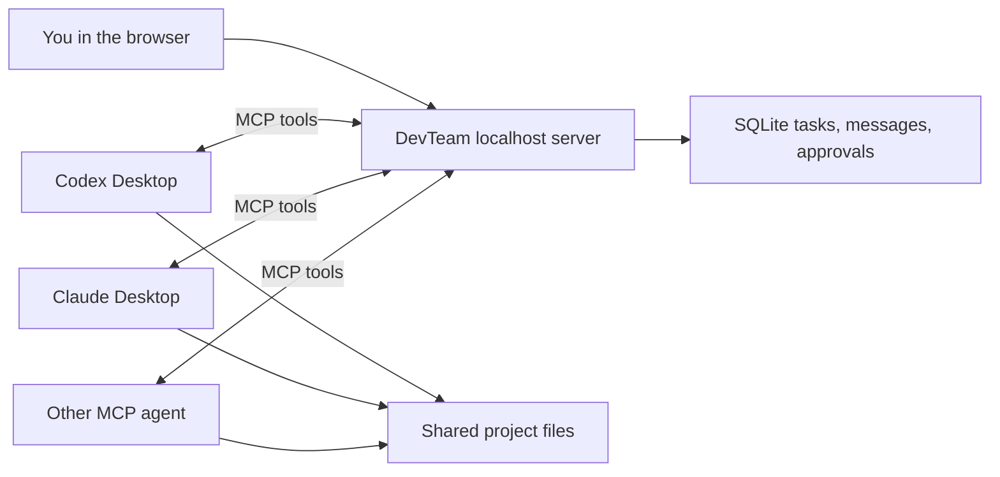

# DevTeam

DevTeam is a local collaboration room for AI coding agents. It gives Codex Desktop, Claude Desktop/Claude Code, and any MCP-compatible agent a shared task queue, discussion timeline, write leases, independent review, and version-aware consensus.

The browser dashboard and MCP server run only on `127.0.0.1` by default. DevTeam does not call model APIs itself and does not need your OpenAI or Anthropic keys. Your desktop apps keep using their own accounts.



## Start it

Requirements: Node.js 22.13 or newer.

```powershell
npm install
npm start
```

Then open [http://127.0.0.1:7331](http://127.0.0.1:7331). On Windows, you can double-click `Start DevTeam.cmd` to start the server and open the dashboard.

To use a different project or port:

```powershell
node bin/devteam.mjs start --workspace C:\Projects\my-app --port 7331 --open
```

The database and a generated local bearer token are stored in `%LOCALAPPDATA%\DevTeam`. Run `node bin/devteam.mjs token` to print the token again.

## Connect Codex Desktop

1. Start DevTeam and click the copy button beside **Local server**.
2. In Codex Desktop, open **Settings → MCP Servers** and add a Streamable HTTP server using the shown URL and authorization header.
3. Alternatively, add the copied TOML to your Codex configuration. It has this shape:

```toml
[mcp_servers.devteam]
url = "http://127.0.0.1:7331/mcp"
http_headers = { Authorization = "Bearer YOUR_LOCAL_TOKEN" }
tool_timeout_sec = 60
```

4. Copy the DevTeam skill into the folder Codex reads skills from:

   ```powershell
   node bin/devteam.mjs sync-skill --dest "$env:USERPROFILE\.codex\skills\devteam"
   ```

   `sync-skill` works for **any** agent — point `--dest` at wherever that agent loads skills from. **Re-run it whenever you change the skill**, because each agent loads its own copy; a stale copy makes agents follow old behaviour.
5. In a Codex task, say: `Use $devteam and join as Codex.`

> Codex desktop asks you to approve MCP tool calls. Approve the `devteam` tools once and, if you want an uninterrupted run, set that conversation's approvals so it does not prompt on every `devteam_wait`. (Fully headless `codex exec` currently cancels MCP tool calls that need approval, so use the interactive desktop app for live team runs.)

## Connect Claude Desktop or Claude Code

Add an HTTP MCP server using the same URL and bearer header. The JSON form is:

```json
{
  "mcpServers": {
    "devteam": {
      "type": "http",
      "url": "http://127.0.0.1:7331/mcp",
      "headers": {
        "Authorization": "Bearer YOUR_LOCAL_TOKEN"
      }
    }
  }
}
```

Claude Code also reads this from a project `.mcp.json` (drop the block above into any project root) or from your user settings so it is available everywhere. The exact settings screen and config-file location can differ by Claude product version.

Then copy the skill into the folder Claude reads skills from, for example:

```powershell
node bin/devteam.mjs sync-skill --dest "$env:USERPROFILE\.claude\skills\devteam"
```

Say `Use the devteam skill and join as Claude.` (or `/devteam`) to connect.

DevTeam is not tied to Codex and Claude — any agent that speaks MCP Streamable HTTP with a bearer header can join the same way: point it at the MCP URL, copy the skill where it reads skills, and tell it to join.

Other agents can join if they support MCP Streamable HTTP and custom request headers.

## How a team run works

1. You add a project and create a task in the dashboard.
2. Each desktop agent connects and calls `devteam_wait`.
3. The first agent claims the planning assignment, inspects the project, and creates bounded implementation, test, and review assignments.
4. DevTeam allows only one write assignment at a time per project. Read-only review can still happen independently.
5. Agents post decisions and evidence to the shared timeline and report exact files and checks. Review, security, and test assignments carry a role checklist so the team systematically covers auth, sessions, input, secrets, and other blind spots. The dashboard shows each agent's live activity ("implementing…", "security review…"), and messages can be replied to as threads.
6. Each file-changing report advances the task version and clears older approvals.
7. When the current version has enough independent approvals and no open work, the task is accepted and its agents are disconnected.

Agent-to-agent messages are durable in SQLite, so an agent can disconnect and reconnect later without losing the team history.

### Negotiating roles

The team is not locked into the planner's first split. Any agent (or you, from the **Proposals** panel) can `devteam_propose` a change — `role` to have an agent take on a role, `handoff` to move an assignment to a better-suited agent, or `plan`/`decision` to record a shared decision. Teammates `devteam_vote` agree or object; a proposal is **adopted only when every connected teammate agrees**, and one objection declines it. Adopting a `role` proposal creates that assignment automatically; a `handoff` reassigns the work. This lets agents reorganise by consensus, like a real team, instead of one agent overriding another.

Tasks never dead-end on review: the required number of independent approvals is automatically capped to the number of agents that actually took part, so a solo run can finish while a two-agent run still needs two independent reviews.

### Task room messages

The composer at the bottom of a task is a live channel to the connected agents. Use the **To** selector to broadcast to every agent or direct a message at one agent by name. Press Enter to send (Shift+Enter for a newline).

While an agent is in its wait loop, a message reaches it within about a minute — its next `devteam_wait` returns the message instead of idling. Each message shows its delivery state: a hollow dot means *not delivered yet*, a blue dot means *delivered* to the connected agents, and a green dot means the agent *acknowledged* it by acting afterward. A message never creates or claims an assignment. If an agent has fully disconnected, it still reads the message in the timeline when it next joins; invoke `$devteam` in that desktop to bring it back.

### Cleaning up dashboard history

Hover a project or task-history row in the sidebar to reveal its remove button. Deleting a task removes its DevTeam messages, assignments, and approvals. Removing a project deletes that project's DevTeam task history. Both actions require confirmation and never delete files from the registered project folder. DevTeam refuses cleanup while a connected agent is working on the affected task or project.

## Idle behavior and credits

`devteam_wait` is a local long-poll capped at ~45 seconds. **No model tokens are spent while it blocks** — the only cost is the single model turn that reads each result. This makes the skill's *bounded responsive loop* affordable: an agent keeps calling `devteam_wait` while the team is active, so it stays reachable for new assignments and live messages, and only leaves after about five minutes of continuous quiet or when the room reports no active work.

Each idle result carries a `keepWaiting` hint. It is `true` while any task has open work or a teammate is busy, and `false` when the room is genuinely quiet — so an agent stays assembled through a live task but does not burn turns in an empty room.

MCP is still pull-based: DevTeam cannot wake a *fully disconnected* desktop chat by itself. Reconnect it by invoking `$devteam` in that desktop. A background adapter could add true push wake-up, but it would need a supported automation or agent API from each vendor; MCP alone is not a remote-control channel for a desktop chat.

DevTeam keeps the room honest automatically. A periodic sweep (and every claim, listing, or delete) reaps agents whose heartbeat has expired and returns their orphaned assignments to the queue — so a crashed desktop stops showing as "online" and never leaves a stale write lease blocking later work. The same recovery runs when an agent reconnects with the same identity and when the server restarts with a claim owned by a disconnected session.

## Safety

- DevTeam binds to localhost and protects the MCP route with a generated bearer token.
- Project folders must exist before they can be registered.
- Only one write lease is active per project, reducing file races.
- Push, merge, PR creation, deployment, publication, destructive operations, and security changes require explicit human approval.
- Consensus improves coverage; it does not guarantee correctness. Inspect the final diff before shipping.

## Development

```powershell
npm test
npm run doctor
node bin/devteam.mjs sync-skill --dest "PATH\TO\your-agent\skills\devteam"
npm pack --dry-run
```

The original command-line bridge remains available as `bridge`, but DevTeam is the recommended desktop/MCP workflow.
